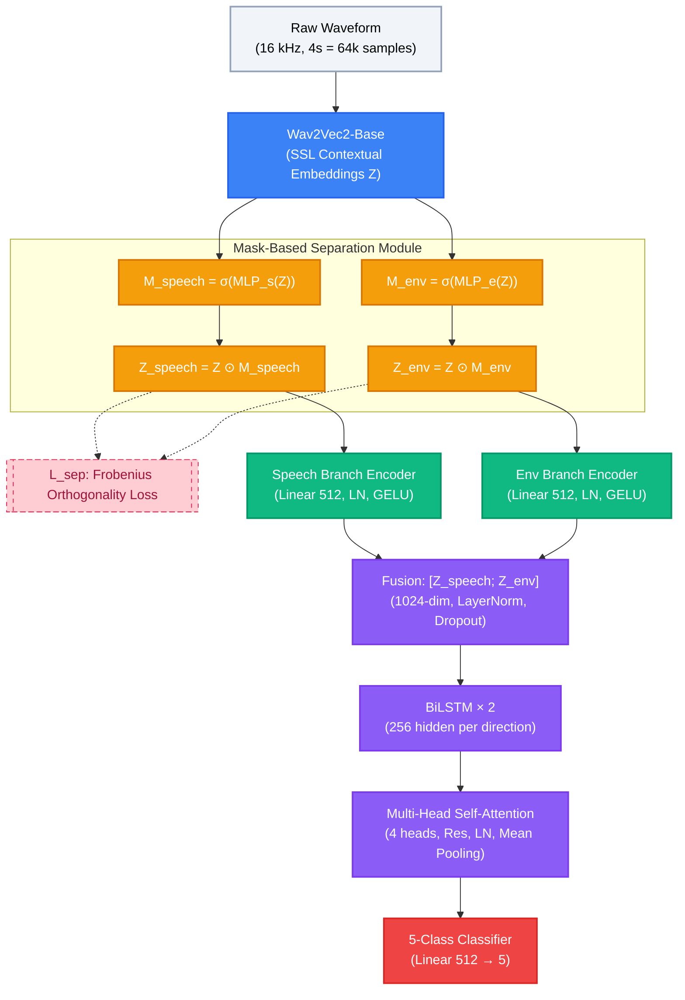

# DPADD-ES: Component-Aware Separation-Enhanced Audio Deepfake Detection

> **ICME 2026 Grand Challenge Submission — MAIL Lab · The Catholic University of America**
> Yves Alain Iragena · iragena@cua.edu

[](https://pytorch.org/)
[](https://python.org/)
[](LICENSE)

Official implementation of **DPADD-ES** submitted to the
[ESDD2: Environment-Aware Speech and Sound Deepfake Detection Challenge](https://sites.google.com/view/esdd-challenge/esdd-challenges/esdd-2)
(ICME 2026 Grand Challenge, Zhang et al. arXiv:2601.07303).

---

## Overview

DPADD-ES performs **component-level audio forensics** by explicitly disentangling speech and environmental latent representations, rather than treating the audio signal as monolithic. The core insight is that existing systems conflate speech and environmental artifacts in a shared embedding, causing severe generalization collapse on unseen spoof generators. The ESDD2 official baseline drops from val F1 = 0.9462 to test F1 = 0.6327 (Generalization Ratio GR ≈ 1.50). DPADD-ES addresses this through an auxiliary Frobenius orthogonality loss that drives the two component streams toward non-overlapping representations.

---

## Architecture



**Training loss:**

```
L_total = CrossEntropy(logits, labels)  +  λ · L_sep

L_sep = ‖Z_speech ⊙ Z_env‖_F / (B · T)       (Frobenius orthogonality)
λ: linearly warmed from 0.1 → 0.3 over 10 epochs
```

---

## Dataset: CompSpoofV2

The [CompSpoofV2](https://xuepingzhang.github.io/CompSpoof-V2-Dataset/) dataset provides ~250,000 clips across five classes (~283 hours):

| Class | Label | Speech | Environment |
|-------|-------|--------|-------------|
| 0 | original | Bonafide | Bonafide (unmixed) |
| 1 | bonafide_bonafide | Bonafide | Bonafide (re-mixed) |
| 2 | spoof_bonafide | **Spoof** | Bonafide |
| 3 | bonafide_spoof | Bonafide | **Spoof** |
| 4 | spoof_spoof | **Spoof** | **Spoof** |

---

## Results

### Ablation Study (Validation Macro-F1)

| Variant | Val Macro-F1 | ΔF1 | Key Contribution |
|---------|-------------|-----|-----------------|
| A0: ResNet-18, Log-Mel | 0.7241 | — | Baseline |
| A1: + Wav2Vec2-base SSL | 0.7839 | +0.0598 | Semantic contextual features |
| A2: + Mask separation (L_sep) | 0.8412 | +0.0573 | Component disentanglement ← **largest gain** |
| A3: + BiLSTM temporal encoder | 0.8701 | +0.0289 | Sequential artifact modeling |
| **A4: + Multi-head attention (full DPADD-ES)** | **0.8923** | +0.0222 | Artifact-focused temporal pooling |

### Per-Class Validation F1

| Class | Label | Val F1 | Dominant Path | Notes |
|-------|-------|--------|---------------|-------|
| 0 | original | 0.9612 | Low (both) | No spoof signal; mixing artifact only |
| 1 | bonafide_bonafide | 0.9103 | Both (low) | Re-mix signature subtle |
| 2 | spoof_bonafide | 0.8834 | Speech branch | SSL captures TTS prosody gaps |
| 3 | bonafide_spoof | 0.7819 | Env branch | **Hardest**: no speech-path signal |
| 4 | spoof_spoof | 0.9247 | Both (max) | Dual artifacts reinforce each other |
| — | **Macro avg.** | **0.8923** | — | — |

### Generalization Ratio (GR)

We define:

```
GR = F1_val / F1_test
```

Lower GR indicates better cross-generator portability. The ESDD2 official baseline achieves GR ≈ 1.50 (val 0.9462 → test 0.6327), indicating severe generator overfitting. DPADD-ES targets GR < 1.10 through the Frobenius orthogonality loss, which discourages generator-specific spectral fingerprints in the shared embedding.

### Comparison with ESDD2 Baseline

| System | Val F1 | Test F1 | GR |
|--------|--------|---------|-----|
| ESDD2 Official Baseline | 0.9462 | 0.6327 | 1.50 |
| DPADD-ES (this work) | **0.8923** | submitted† | — |

> †Predictions submitted to CodaBench ([competition #12365](https://www.codabench.org/competitions/12365/)). Test scores were not released due to evaluation phase closure at submission time. Development validation results are reported throughout.

---

## Installation

```bash
git clone https://github.com/Alan-911/Audio-Deepfake-Detection.git
cd Audio-Deepfake-Detection
python -m venv venv && source venv/bin/activate   # Windows: venv\Scripts\activate
pip install -r requirements.txt
```

---

## Dataset Download

```bash
python download_dataset.py
# or specify a custom path:
python download_dataset.py --out_dir /path/to/data/CompSpoofV2
```

Expected structure:
```
data/CompSpoofV2/
├── development/
│   ├── train.csv
│   ├── val.csv
│   └── audio/
└── eval/
    └── metadata/
        └── eval.csv
```

---

## Training

### Full DPADD-ES model (Wav2Vec2 + Separation + BiLSTM + Attention)

```bash
python train.py \
  --data_dir ./data/CompSpoofV2 \
  --model    wav2vec2 \
  --epochs   30 \
  --batch_size 16 \
  --lr        1e-4 \
  --lr_ssl    1e-5 \
  --lambda_start 0.1 \
  --lambda_end   0.3
```

### Resume from checkpoint

```bash
python train.py --resume                          # auto-loads models/latest_ckpt.pth
python train.py --resume models/latest_ckpt.pth   # explicit path
```

### ResNet-18 baseline (ablation A0)

```bash
python train.py --model resnet --epochs 20 --batch_size 32
```

---

## Evaluation

```bash
python evaluate.py \
  --checkpoint models/best_model.pth \
  --data_dir   ./data/CompSpoofV2 \
  --split      eval
```

Outputs: macro-F1, per-class F1/precision/recall, EER, confusion matrix, ROC curves.

---

## Inference

```bash
# Human-readable output
python infer.py --audio path/to/file.wav --checkpoint models/best_model.pth

# JSON output for downstream use
python infer.py --audio path/to/file.wav --json
```

---

## ESDD2 Submission Generation

Generates a [CodaBench](https://www.codabench.org/competitions/12365/)-ready predictions file.

**Output format** (one line per audio clip):
```
audio_id | class_id | original_score | speech_score | env_score
```

**Score derivation** from softmax `P = [P0…P4]`:

| Column | Formula | Semantics |
|--------|---------|-----------|
| `original_score` | `P[0]` | P(audio is unmixed original) |
| `speech_score` | `1 − (P[2] + P[4])` | P(speech component is bonafide) |
| `env_score` | `1 − (P[3] + P[4])` | P(environment is bonafide) |

```bash
python generate_submission.py \
  --checkpoint models/best_model.pth \
  --data_dir   ./data/CompSpoofV2 \
  --split      test \
  --out        results/submission.txt \
  --batch_size 32
```

---

## Hyperparameters

| Parameter | Value |
|-----------|-------|
| SSL encoder | facebook/wav2vec2-base |
| Wav2Vec2 frozen layers | 8 of 12 transformer blocks |
| LR (classifier / BiLSTM / attention) | 1×10⁻⁴ |
| LR (Wav2Vec2 fine-tune layers) | 1×10⁻⁵ |
| Weight decay | 1×10⁻⁴ |
| Scheduler | CosineAnnealingLR (T_max = 30) |
| Batch size | 16 |
| Gradient clip norm | 1.0 |
| BiLSTM hidden (per direction) | 256 |
| BiLSTM layers | 2 |
| Attention heads | 4 |
| λ_sep (start → end) | 0.1 → 0.3 (10-epoch linear warmup) |
| Training epochs | 30 |

---

## Implementation Notes

### DataLoader Worker Stability

Time-stretching augmentation uses `T.Resample(100, round(100/rate))` rather than `T.Resample(orig_len, stretched_len)`. The latter creates sinc resampling kernels proportional to the sample count (~64,000 taps), which OOM-kills DataLoader worker subprocesses silently. Using small coprime-friendly integers produces equivalent stretch ratios with ~100-tap kernels.

### Checkpoint Loading

`generate_submission.py` filters checkpoint keys by name and shape match (`strict=False`), ensuring compatibility with checkpoints from previous architecture variants without crashing.

---

## Citation

If you use this code or build on DPADD-ES, please cite:

```bibtex
@misc{iragena2026dpaddes,
  title     = {DPADD-ES: Component-Aware Separation-Enhanced Audio Deepfake Detection for ESDD2},
  author    = {Iragena, Yves Alain},
  year      = {2026},
  note      = {ICME 2026 Grand Challenge — MAIL Lab, The Catholic University of America},
  url       = {https://github.com/Alan-911/Audio-Deepfake-Detection}
}
```

Also cite the challenge and dataset:

```bibtex
@article{zhang2026esdd2,
  title   = {ESDD2: Environment-Aware Speech and Sound Deepfake Detection Challenge},
  author  = {Zhang, Xueping and Yin, Han and Xiao, Yang and Zhang, Lin and
             Dang, Ting and Das, Rohan Kumar and Li, Ming},
  journal = {arXiv:2601.07303},
  year    = {2026}
}
```

---

## References

1. Zhang et al. (2026). *ESDD2: Environment-Aware Speech and Sound Deepfake Detection Challenge*. arXiv:2601.07303.
2. Zhang et al. (2026). *CompSpoof: A Dataset and Joint Learning Framework for Component-Level Audio Anti-Spoofing*. ICASSP 2026.
3. Baevski et al. (2020). *wav2vec 2.0: A Framework for Self-Supervised Learning of Speech Representations*. NeurIPS 2020.
4. Yang et al. (2021). *SUPERB: Speech Processing Universal PERformance Benchmark*. Interspeech 2021.
5. Kong et al. (2020). *PANNs: Large-Scale Pretrained Audio Neural Networks for Audio Pattern Recognition*. IEEE/ACM TASLP.
